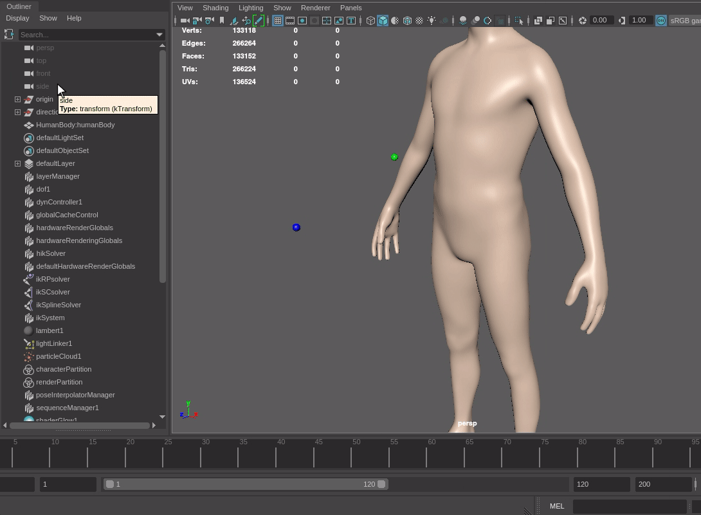

# `maya-ray-intersect`

At the moment, performing a simple ray intersect operation in stock Maya requires dipping into Bifrost. This plugin introduces a simpler, more performant option in the form of a ray intersect node and accompanying command.

## Overview
rayIntersect is split into two parts: a command and a node. Both take a ray origin, ray direction, and mesh. An infinite ray is constructed from the given origin and direction, and the nearest intersection with the given mesh is provided as worldspace coordinates. 

If no intersection is found, the transform is set to the origin.

## Using the Command

The `rayIntersect` command requires that you select the origin, direction, and mesh *in that order* and outputs an empty group at the resulting intersection, or the origin if no intersection is found.

Once the relevant objects are selected, simply invoke `rayIntersect` from the MEL command line.

The result *is not live*. If either the origin or direction are moved, the command must be run again to recieve an up-to-date intersection.

## Using the Node

The `rayIntersectNode` node takes worldspace coordinates as its origin and direction input, and a mesh as its collision mesh input. It outputs worldspace coordinates at the nearest intersection with the given mesh, or the origin if no intersection is found.

The resulting coordinates *are live*, and will update in real-time as either the origin or direction objects are moved in the scene.

> [!NOTE]
> These inputs must be hooked up manually through the Node Editor. I intend to update this in the future so an instance of the node is created and wired by the command.

## Installation

1. Copy the provided files into a directory of your choice
2. Compile with CMake
3. Copy the resulting build file into a directory within `MAYA_PLUG_IN_PATH`
